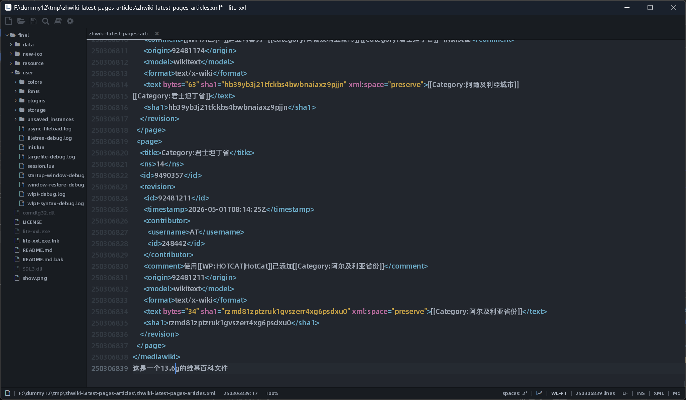

# Lite-xxL

<p align="center">
  <strong>A lightweight editor for normal text and huge text files.</strong>
</p>

<p align="center">
  <strong>基于 Lite XL 二次开发，支持普通文件编辑、UTF-8 中文编辑，并针对超大文本文件阅读、跳转、编辑与保存进行优化。</strong>
</p>

<p align="center">
  <a href="resource/lite-xl/LICENSE"></a>
  
  
</p>

## 项目简介

Lite-xxL 是基于 Lite XL 二次开发的轻量级文本编辑器。它保留了 Lite XL 原有的 Lua + C 架构，并在此基础上重构和扩展了文件处理核心链路。

Lite-xxL 重点改造的是文档层，也就是普通文件与大文件如何加载、表示、渲染、编辑和保存。对于普通文件，Lite-xxL 保留小文件编辑链路；对于超大文件，Lite-xxL 增加了专门的大文件链路，通过 C 层后台索引、窗口化读取、Lua 前端按需渲染，优化 GB 级文本文件的打开、浏览、跳转、编辑与保存。

同时，Lite-xxL 补齐了 UTF-8 编码处理能力，使编辑器能够正确处理和编辑中文等 UTF-8 文本内容。

当前版本已经支持秒级打开 13.6 GB 的维基百科文本文件，并支持对其进行浏览、随机行跳转、增删改查与保存操作。在同等测试文件下，Lite-xxL 申请的内存空间约为 2 GB，内存与磁盘文件大小比例约为 14%；作为对比，EmEditor 在相同文件上约需申请 7 GB 内存。

除了文件处理能力，Lite-xxL 也优化了界面交互、布局体验，并实验性支持大文件语法高亮，以提升长文本阅读和编辑体验。

下载地址：[https://tangdeyx2333-beep.github.io/lite-xxl/](https://tangdeyx2333-beep.github.io/lite-xxl/)

<p align="center">
  
</p>

## 为什么选择 Lite-xxL

**小文件和大文件双链路**：普通文件走常规编辑链路，超大文件走专门的大文件链路，不用牺牲日常编辑体验来换取大文件性能。

**UTF-8 中文编辑支持**：补齐 UTF-8 编码处理能力，可以正确编辑中文等多字节文本内容。

**64 位文件偏移**：底层使用 64 位文件偏移定位内容，理论寻址上限可覆盖 16 EB 级别文件空间。

**近似常数级首屏开销**：大文件打开后，前端主要处理当前视口附近的数据，而不是按文件总大小一次性加载全文。

**局部编辑开销可控**：在当前窗口和已定位编辑位置附近，增删改查主要发生在 Piece Table 的局部片段上，通常不需要搬动完整原文，因此大文件编辑开销更接近局部操作成本，而不是文件总大小成本。

**响应优先**：尽量避免因为加载、保存或渲染大文件而阻塞主界面。

**超大文件友好**：针对 GB 级文本文件优化打开、滚动、跳转和编辑链路。

**随机行跳转快**：通过 C 层密集行索引快速定位任意行。

**内存占用更可控**：约 14 GB 文件测试中，内存申请约 2 GB。

**保存更安全**：保存采用拷贝写入思路，即使保存失败，也尽量避免破坏源文件。

**界面更顺手**：在 Lite XL 基础上调整了 UI 观感和交互布局。

**开源可改**：欢迎 Issue、PR 和真实大文件场景反馈。

## 快速开始

### 直接运行

如果你只是想体验当前版本，可以直接运行项目根目录下的 `lite-xl.exe`。

如果你使用的是发布包，请将可执行文件、`data` 目录以及相关动态库放在同一目录下，再启动程序。

### 打开普通文件

对于普通大小的代码、配置、Markdown 和文本文件，Lite-xxL 会继续使用小文件编辑链路，以保留完整的日常编辑体验。

### 打开大文件

启动 Lite-xxL 后，可以通过菜单或文件打开方式选择目标文本文件。对于超大文件，Lite-xxL 会优先走大文件路径，并按当前视口加载需要显示的内容。

建议优先使用纯文本、日志、数据导出、Wiki dump 等大文本文件进行测试。

## 核心能力

### 小文件编辑链路

Lite-xxL 并没有只服务于大文件。对于普通大小的文件，它仍然保留小文件编辑链路，用于日常文本、代码、配置文件和 Markdown 编辑。

小文件链路更适合完整文本加载、常规编辑、撤销重做、插件交互和普通代码编辑体验；大文件链路则更关注窗口化加载、低内存占用和超大文本可响应。

两条链路各自服务不同场景，避免用同一种模型同时承担“小文件精细编辑”和“大文件高性能浏览编辑”的压力。

### UTF-8 编码支持

Lite XL 原始链路对 UTF-8 中文编辑支持并不完整。Lite-xxL 补齐了 UTF-8 编码处理能力，使编辑器可以正确处理中文等多字节字符。

这意味着 Lite-xxL 不只是能打开大文件，也能更可靠地编辑包含中文内容的普通文本和大文件文本。

### 大文件秒开

Lite-xxL 不会把整个文件一次性塞进 Lua 层，而是由 C 层后台线程增量读取文件并建立行索引。前端只请求当前窗口附近需要显示的内容。

这让打开大文件的体验不再完全受文件总大小支配，而是更多取决于当前视口需要渲染的数据量。

### 高性能随机行跳转

C 层会为文件建立“行号到文件偏移”的密集索引。跳转到任意行时，Lite-xxL 可以通过地址偏移快速定位目标行附近的数据，而不是从头扫描整个文件。

### 可控内存占用

Lite-xxL 的设计重点是限制单次传输给 Lua 的文本量，以及限制前端单帧需要处理的行数。这样可以避免超大文件导致 Lua 层内存和渲染压力失控。

### 大文件编辑与保存

Lite-xxL 通过 Piece Table 思路把物理文件修改抽象为逻辑修改。编辑时不会直接破坏原始文件内容，而是维护编辑片段之间的关系，并在保存阶段生成新的文件结果。

## 文件处理架构

Lite-xxL 的文件处理并不是单一路径，而是分为小文件链路和大文件链路。

小文件链路用于普通文本和代码编辑，保留更完整的常规编辑体验。

大文件链路用于 GB 级文本文件，通过 `WL + PT` 架构解决加载、渲染、跳转、编辑和保存问题。

Lite-xxL 的大文件处理主要围绕 `WL + PT` 展开。

`WL` 负责大文件读取、索引、窗口化传输和按量渲染。

`PT` 负责把大文件编辑抽象成逻辑片段操作，降低直接修改原始文件带来的风险。

### 打开文件后的两条链路

Lite-xxL 在打开文件后，并不是所有文件都走同一条读取链路。当前实现会先读取文件前 `4KB`，如果发现 `0x00`，就把文件判定为二进制文件；否则继续按文本文件处理。

整体分流关系如下：

```text
[ 打开文件 ]
        │
C backend 读取前 4KB
        │
【 是否包含 0x00？】
        │
┌───────┴───────────────────────────────┐
│                                       │
否：文本模式                            是：二进制 Hex 模式
(binary_mode = false)                   (binary_mode = true)
│                                       │
C backend 从头扫描整个文件              C backend 不扫描整个文件找 \n
│                                       │
遇到 \n 记录下一行 byte offset          不建立密集 line_offsets
│                                       │
建立文本密集行索引 line_offsets         只计算虚拟总行数 line_count = ceil(file_size / 16)
│                                       │
Lua / DocView 请求可视区行号            Lua / DocView 请求可视区行号
│                                       │
C 查 line_offsets 得第 N 行范围         C 用公式算 offset = (N - 1) * 16
│                                       │
C 读取这一行原始文本 bytes              C seek(offset) + read(16 bytes)
│                                       │
直接把这一行文本返回给 Lua               C 把 16 bytes 格式化成一行 hex 文本
│                                       │
Lua 存进 LargeFileDoc.chunk_cache       Lua 存进 LargeFileDoc.chunk_cache
│                                       │
DocView 从 chunk_cache 取 line          DocView 从 chunk_cache 取 line
│                                       │
Lua 计算可视布局 / x,y / 软换行         Lua 计算可视布局 / x,y
│                                       │
C renderer 按 UTF-8 解码文本            C renderer 画的是 hex 文本字符
│                                       │
FreeType 取字形                         FreeType 取字形
│                                       │
└───────────────────┬───────────────────┘
                    │
                [ 画到 tab ]
```

这里最关键的区别是：

- 文本模式下，第 `N` 行的位置要靠 `line_offsets` 查表得到。
- 二进制模式下，第 `N` 行的位置不靠表，而是直接用公式 `offset = (N - 1) * 16` 计算。
- 二进制模式显示在 tab 中的并不是原始 bytes，而是 C 后端转换出来的 hex 文本行；这些 hex 文本行同样会进入 `LargeFileDoc.chunk_cache`，后续再由 `DocView` 按普通文本方式渲染。

基于密集行索引和窗口化读取，Lite-xxL 的大文件打开体验不会随着文件大小线性变差。对于前端来说，不同大小的大文件首屏显示通常都可以被压缩到“定位目标区域 + 渲染当前窗口”的近似常数级工作量。

在编辑链路上，Lite-xxL 通过 Piece Table 将物理文件修改转化为逻辑片段操作。对于当前窗口附近的增删改查，编辑器通常只需要调整相关片段节点，而不需要移动或重写完整原文，因此局部编辑性能也更接近常数级开销。

不过需要说明的是，当前 PT 底层仍使用双向链表维护片段节点。当编辑次数非常多、节点数量持续增长时，部分查找和整理操作仍可能受到节点数量影响。因此长时间大量编辑后，如果感觉性能下降，可以保存一次，让文件结构重新整理。

### WL：Window Load

WL，即窗口加载机制。

后端 C 层会建立 8 字节密集行索引，用于记录每一行在文件中的起始偏移。前端 Lua 层则根据用户当前可视范围主动请求数据。

经过测试，单次请求约 256 行可以显著降低 Lua 渲染开销，从而获得更流畅的阅读体验，并尽量让单个任务控制在 16.6ms 的帧预算内完成。

整体链路如下：

打开文件 -> C 后台线程读取文件 -> 增量建立行偏移索引 -> Lua 根据当前视口请求行窗口 -> C 按索引读取窗口数据 -> Lua 缓存并渲染当前可见内容。

这个设计的关键点是：文件再大，前端也不需要一次性处理完整文件。Lite-xxL 只把当前窗口附近的数据交给 Lua，从而把大文件问题压缩成“当前视口工作量”的问题。

### PT：Piece Table

PT，即 Piece Table 编辑模型。

Lite-xxL 通过 mmap 和 Piece Table 思路，将对源文件的物理修改抽象为逻辑修改。文件内容会被抽象为多个片段节点，并通过节点之间的关系维护编辑后的文本结果。

这样一来，插入、删除、查询和修改操作不会直接改动原始文件内容，而是转化为节点之间的增删改查。

当前 PT 底层使用双向链表实现，因此编辑性能主要取决于链表节点操作效率。目前节点增删改查复杂度为 `O(n)`，其中 `n` 与编辑产生的节点数量相关。也就是说，修改次数越多，链表越复杂，编辑性能可能会逐渐下降。

如果长时间编辑后感觉变卡，可以先保存一次，让文件结构重新整理。

## 构建

项目基于 Meson 构建系统。

Windows 下建议使用 **Developer Command Prompt for VS 2022** 或 **Developer PowerShell for VS 2022** 构建项目，普通 PowerShell / CMD 可能缺少 MSVC、Windows SDK、`rc.exe` 等环境变量。

常见构建流程：

进入 `resource\lite-xl` 目录。

执行 `meson setup build --buildtype=release`。

执行 `meson compile -C build`。

如果 Meson 提示找不到资源编译器、C 编译器或链接器，请先确认当前终端是否为 Visual Studio Developer 环境。

如果你只是使用发布版本，一般不需要自己构建。

## 当前状态

Lite-xxL 当前可以作为 stable 版本发布，但它仍然是个人维护的小作坊项目，稳定性和边界场景还需要更多真实文件测试。

已重点验证的方向包括：

打开 13.6 GB 级别文本文件。

大文件浏览。

随机行跳转。

大文件增删改查。

大文件保存。

窗口化渲染。

UTF-8 中文文本编辑。

基础 UI 交互。

仍建议在处理重要文件前先做好备份。

## 已知限制

超大文件高亮仍属于实验性能力。

极高频、长时间编辑后，Piece Table 节点数量增加，性能可能下降。

不同文件编码、超长单行、异常换行格式可能存在未覆盖场景。

构建环境在不同 Windows 机器上可能需要额外配置。

当前文档和发布流程还在完善中。

## 适合场景

Lite-xxL 更适合这些场景：

日常代码、配置、Markdown 和普通文本编辑。

编辑包含中文的 UTF-8 文本。

打开大型日志文件。

查看数据库导出文本。

阅读 Wiki dump 或超大纯文本。

快速定位某一行附近的内容。

对大文件进行轻量编辑和保存。

如果你的工作主要是普通代码编辑，原版 Lite XL 仍然是非常优秀的选择。Lite-xxL 的重点是在保留轻量编辑体验的基础上，补齐 UTF-8 中文编辑能力，并强化超大文本文件处理能力。

## 反馈与贡献

欢迎提交 Issue、PR 或测试反馈，尤其欢迎提供真实的大文件使用场景，例如：

文件大小。

文件类型。

编码格式。

打开耗时。

跳转体验。

保存是否成功。

是否出现卡顿或崩溃。

这些反馈会直接帮助 Lite-xxL 继续优化文件处理链路。

## 致谢

Lite-xxL 基于 Lite XL 二次开发，感谢 Lite XL 项目和社区提供的优秀编辑器基础。

## License

本项目继承 Lite XL 相关许可，详见 `resource/lite-xl/LICENSE` 和 `resource/lite-xl/licenses/licenses.md`。
